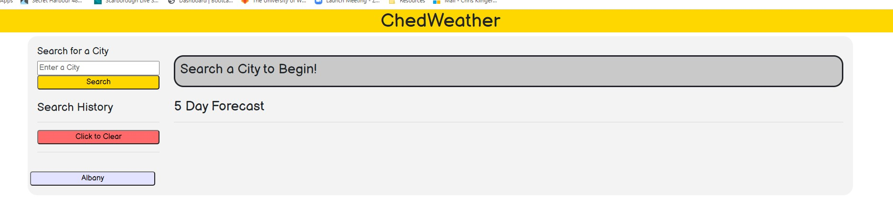
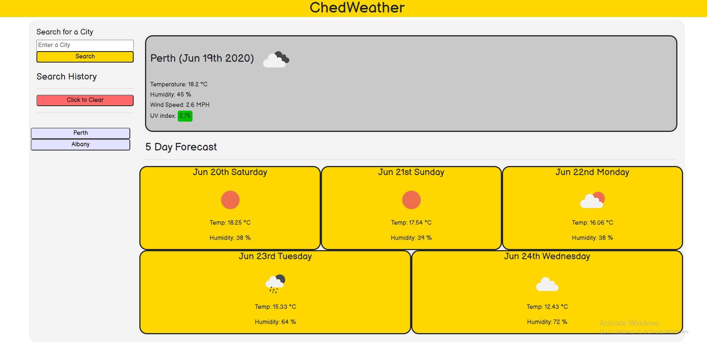
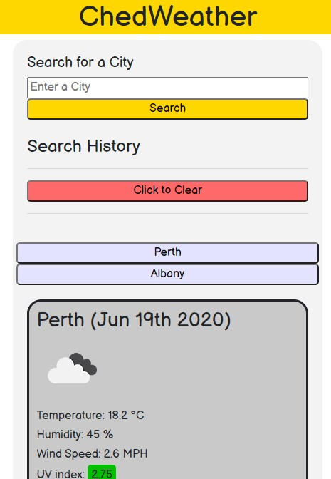

# Weather Forecast API&middot;  

## Deployed Site
Repository Link = https://github.com/ChrisAMK/Weather-Forecast-API.git

Deployed Site Link = https://chrisamk.github.io/Weather-Forecast-API/

## Description 
For this weeks assignment we are tasked to re-create a weather dashboard using the Open Weather API, the general gist of the task was to get the user input and then query the API to get information returned back as a object, then display that information in a way the User can plan there trip. I also used Moments.js for the dates and time. The acceptaince criteria was that the user chosen city must display the Date, City Name, a Representation of the weather condition with an Icon, Temperature, Humidity, Wind Speed and the Uv Index that is to be color coded depending on the Value. The user also wants to see the 5 day forcast of that area in brief detail. The user can also see all the searches made in a history tab and are clickable to display the information.

## Table of Contents 
* [Installation](#Installation)
* [Usage](#Usage)
* [License](#License)
* [Contributions](#Contributions)
* [Tests and Examples](#Tests)
* [Questions](#Questions)

## Installation  
No installion Required, just go the the deployed link provided above

## Usage  
To see the weather forecase of a particular city

## License  
Academic Free License v3.0

[Click Here to go to License Site!](https://opensource.org/licenses/AFL-3.0)

## Tests and Examples  
Search a city in the search bar and press Search to be shown that cities weather forecast

## Questions  
If there are any questions feel free to reach me at [Github](https://github.com/ChrisAMK)

or E-mail me at chriskl@live.com

